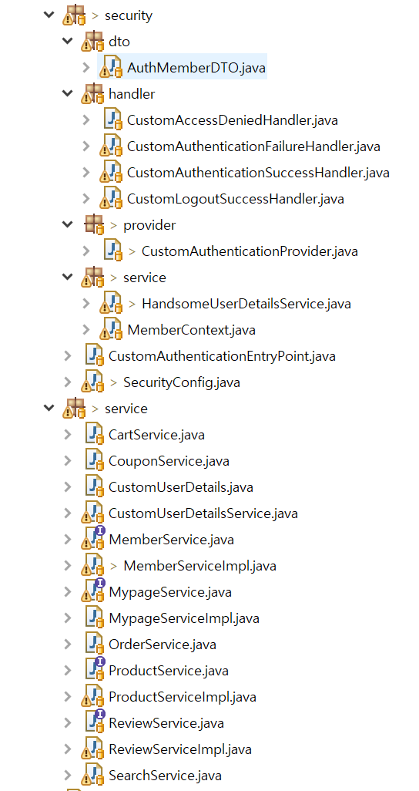
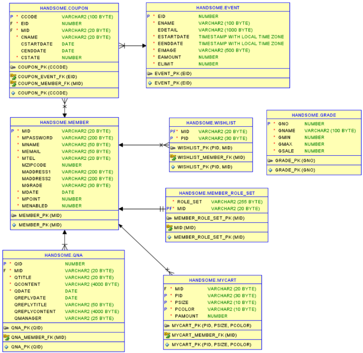
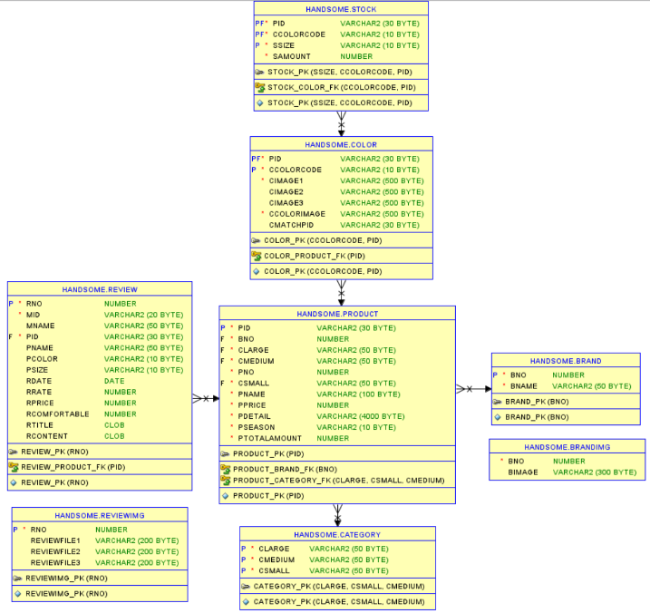
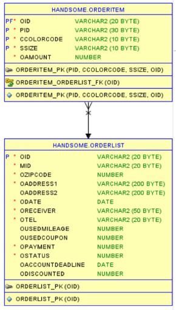
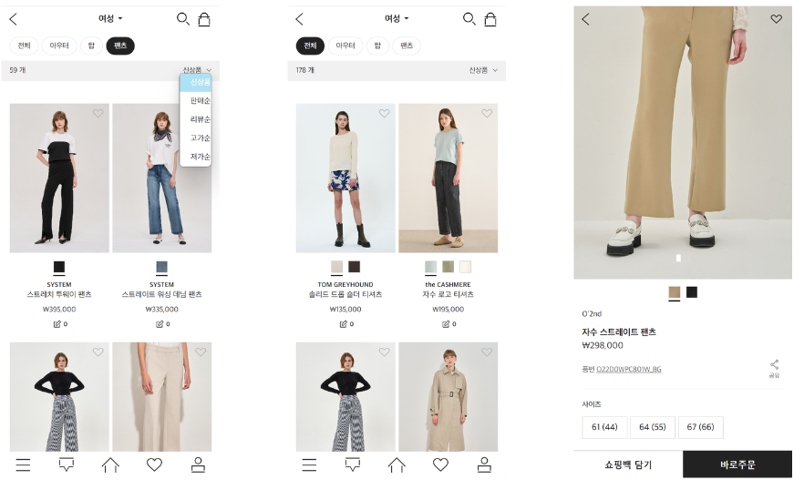
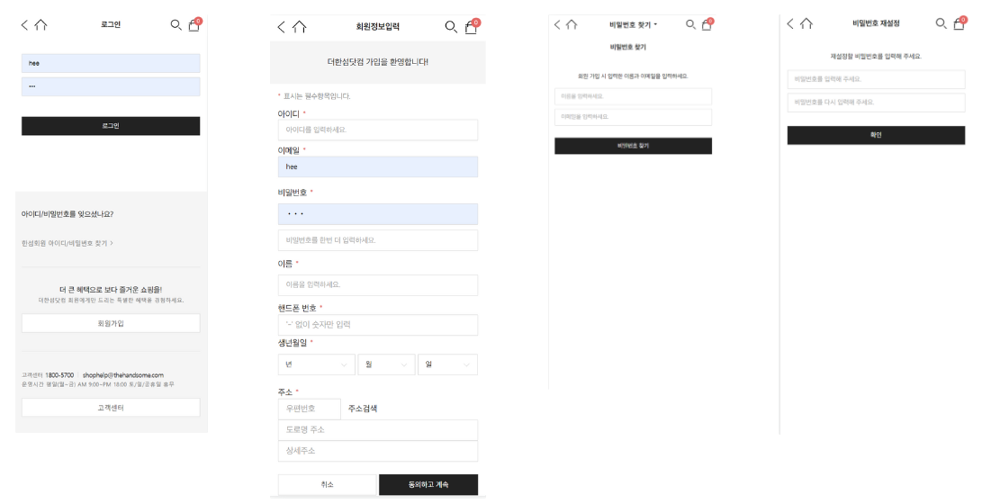
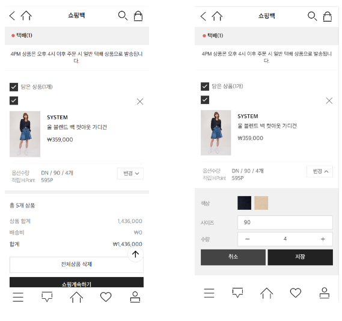
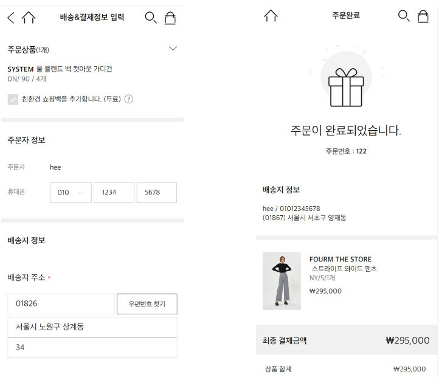
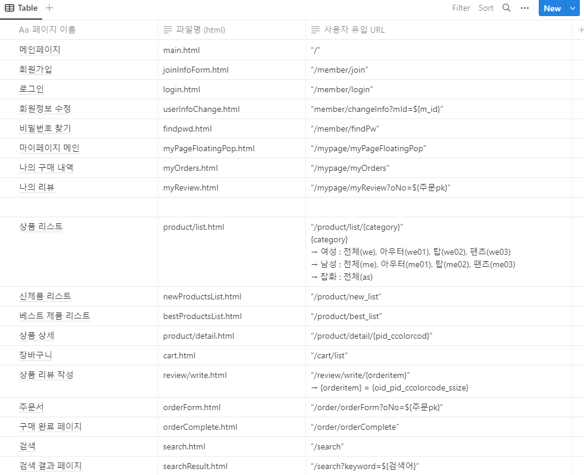

## 💡 서비스 소개

**더한섬몰 모바일 클론코딩**

> 현대백화점그룹의 더한섬몰 모바일 서비스 클론 코딩 프로젝트입니다. 
패션 애플리케이션처럼 ‘더한섬닷컴’을 모바일 웹뷰로 클론 코딩해 29CM, 무신사, WConcept, 지그재그와 같은 최근 패션 애플리케이션 서비스를 분석했습니다.

## 🛠️ 기술 스택

 
    
   
   
   
   
   
   
   
   
   
  
  
  
   

상세 기술스택 및 버전

| 구분 | 기술스택 | 상세 | 버전 |
| --- | --- | --- | --- |
| 공통 | 형상관리 | Github | - |
|  | 이슈관리 | Jira | - |
|  | 커뮤니케이션 | Slack, Confluence, Notion | - |
| Front-end | HTML5 |  | - |
|  | CSS3 |  | - |
|  | JavaScript(ES6) |  | - |
|  | JSP |  | - |
|  | IDE | Eclipse | 1.69.2 |
| Back-end | Java | JDK | 1.8.0_192 |
|  | SpringBoot | springboot | 2.7.8 |
|  |  | Maven | - |
|  |  | Thymeleaf | 7.5 |
|  |  | SpringSecurity | - |
|  |  | MyBatis | - |
|  | Android | - | 12.0 |
|  | API관리 | Swagger | 2.9.2 |
|  | jsonwebtoken |  | 1.1.1 |
|  | DB | Oracle | 8.0.30-0ubuntu0.20.04.2 |
|  | IDE | Eclipse, Android Studio | - |
|||||

## 🗃️프로젝트 구조

### 📂 디렉토리 구조

## 🔗****Database Modeling****

## 💻 주요 기능 및 스크린 샷

### **상품**

- 상품은 카테고리별, 브랜드별로 확인이 가능하고, 신상품-판매순-리뷰순-고가순-저가순 등 5가지 방식으로 정렬이 가능합니다.
- 상품 리스트 페이지는 무한 스크롤로 구현해 페이지 많은 한번에 상품 로드시 시간이 지연되는 것을 감소했고, 앱 사용자의 사용성을 극대화했습니다.
- 상품 상세 페이지에서는 상품의 색상과 사이즈를 비롯한 정보가 조회 가능하고, 색상과 수량을 선택해 장바구니에 담거나 바로 주문이 가능합니다.

### **회원관리**

- 회원가입시 입력했던 이메일을 통해 비밀번호 재설정 링크를 받을 수 있으며, 비밀번호를 비롯한 회원정보 수정이 가능합니다.
- 모바일 특성상 버튼 선택 없이 실시간 아이디 중복 확인이 가능합니다.
- 회원가입 및 로그인 여부에 따라 접근할 수 있는 페이지가 제한되어 있습니다.
- 마이페이지에서 주문한 내역과 상품 정보를 조회할 수 있습니다.

### **장바구니 및 결제**

- 장바구니에서 상품을 선택하고 주문하기를 누르면 선택한 상품 정보와 함께 주문서 페이지로 이동합니다.
-  회원 가입을 할 때 입력했던 정보들이 기본값으로 입력되어 있고, 주문시 수정이 가능합니다.
- 사용자가 가진 쿠폰 정보와 포인트를 조회해 선택한 상품에 할인을 적용할 수 있습니다.
- 결제버튼을 누르면 카카오페이로 결제가 가능합니다.

## 🗣️ 협업 관리

**Notion**

## 👩‍👩‍👧 개발 멤버 소개

## 📅 프로젝트 기간

### 23.02.06 ~ 23.02.15

- **기획 및 설계** : 23.02.06 ~ 23.02.07
- **프로젝트 구현** : 23.02.07 ~ 23.02.14
- **버그 수정 및 산출물 정리** : 23.02.15 ~ 23.02.15

## 📄 프로젝트 관련 문서

| 구분 | 링크 |
| --- | --- |
| 기능 정의서 | [기능 정의서 보러 가기](https://docs.google.com/spreadsheets/d/1CI9egWBXCCFFI9j7Fb8b0Ecweyp0P8YcEFBEobTa9WA/edit#gid=0) |
| API 정의서 | [API 정의서 보러 가기](https://www.notion.so/6e62600923454d29a9e51736b4528aa9?v=f3a5e88850c14830a57d246f9e0f2b2e) |
| 프로젝트 보고서 | [보고서 보러 가기](https://angry-catboat-48b.notion.site/45e76ce58248472a8873ef63239df08d?pvs=4) |

